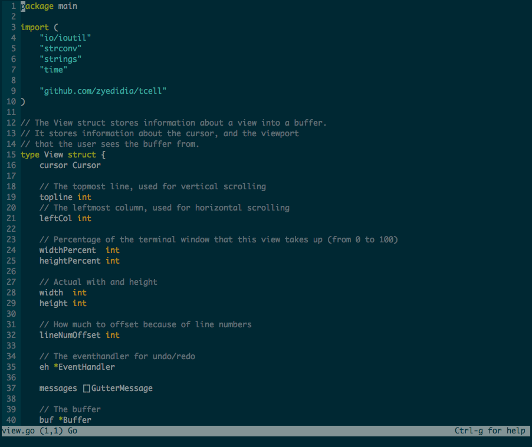

# Micro

[](https://travis-ci.org/zyedidia/micro)
[](http://goreportcard.com/report/zyedidia/micro)
[](https://github.com/zyedidia/micro/blob/master/LICENSE)

> Micro is very much a work in progress

Micro is a terminal-based text editor that aims to be easy to use and intuitive, while also taking advantage of the full capabilities
of modern terminals.

Here is a picture of micro editing its source code.



# Features

* Easy to use
* Common keybindings (ctrl-s, ctrl-c, ctrl-v, ctrl-z...)
* Extremely good mouse support
* Cross platform
* Syntax highlighting (in over [75 languages](runtime/syntax)!)
* Colorscheme support
* True color support (set the `MICRO_TRUECOLOR` env variable to 1 to enable it)
* Search and replace
* Undo and redo
* Unicode support
* Copy and paste with the system clipboard
* Small and simple
* Configurable

If you'd like to see what has been implemented, and what I plan on implementing soon-ish, see the [todo list](todolist.md)

# Installation

### Homebrew

If you are on Mac, you can install micro using Homebrew:

```
brew tap zyedidia/micro
brew install --devel micro
```

Micro is devel-only for now because there is no released version.

### Prebuilt binaries

| Download |
| --- |
| [Mac OS X](http://zbyedidia.webfactional.com/micro/binaries/micro-osx.tar.gz) |
| [64 bit Linux](http://zbyedidia.webfactional.com/micro/binaries/micro-linux64.tar.gz) |
| [32 bit Linux](http://zbyedidia.webfactional.com/micro/binaries/micro-linux32.tar.gz) |
| [Arm Linux](http://zbyedidia.webfactional.com/micro/binaries/micro-linux-arm.tar.gz) |

To run the micro binary just run `./bin/micro` (you may want to place the binary on your path for ease of use).

### Building from source

Micro is made in Go so you must have Go installed on your system to build it.

You can simply `go get` it.

```
go get -u github.com/zyedidia/micro/cmd/micro
```

### Clipboard support

On Linux, clipboard support requires 'xclip' or 'xsel' command to be installed. For Ubuntu:

```
$ sudo apt-get install xclip
```

# Usage

Once you have built the editor, simply start it by running `micro path/to/file.txt` or simply `micro` to open an empty buffer.

Micro also supports creating buffers from `stdin`:

```
$ ifconfig | micro
```

You can move the cursor around with the arrow keys and mouse.

#### Keybindings

* Ctrl-q:   Quit
* Ctrl-s:   Save
* Ctrl-o:   Open file
* Ctrl-z:   Undo
* Ctrl-y:   Redo
* Ctrl-f:   Find
* Ctrl-n:   Find next
* Ctrl-p:   Find previous
* Ctrl-a:   Select all
* Ctrl-c:   Copy
* Ctrl-x:   Cut
* Ctrl-v:   Paste
* Ctrl-h:   Open help
* Ctrl-u:   Half page up
* Ctrl-d:   Half page down
* PageUp:   Page up
* PageDown: Page down
* Home:     Go to beginning
* End:      Go to end
* Ctrl-e:   Execute a command

You can also use the mouse to manipulate the text. Simply clicking and dragging will select text. You can also double click
to enable word selection, and triple click to enable line selection.

# Configuration

Configuration directory:

Micro uses the `$XDG_CONFIG_HOME/micro` as the configuration directory. As per the XDG spec,
if `$XDG_CONFIG_HOME` is not set, `~/.config/micro` is used as the config directory.

At this point, there isn't much you can configure.
Micro has a few options which you can set:

* colorscheme
* tabsize
* syntax
* tabsToSpaces

To set an option run Ctrl-e to execute a command, and type `set option value`, so to set the tabsize to 8 it would be `set tabsize 8`. The default is 4.

The syntax option can simply be on or off, so for example to turn syntax highlighting off, run `set syntax off`. The default is on.

The tabsToSpaces option is on or off. It specifies whether to use spaces instead of tabs or not. The default is off.

The colorscheme can be selected from all the files in the `ConfigDir/colorschemes/` directory. Micro comes by default with three colorschemes:

* default: this is the default colorscheme.
* solarized: this is the solarized colorscheme (used in the screenshot). You should have the solarized color palette in your terminal to use it.
* solarized-tc: this is the solarized colorscheme for true color, just make sure your terminal supports true color before using it and that the `MICRO_TRUECOLOR` environment variable is set to 1 before starting micro.

These are embedded in the Go binary, but to see their source code, look [here](./runtime/colorschemes)

Any option you set in the editor will be saved to the file `ConfigDir/settings.json` so, in effect, your configuration file will be created
for you. If you'd like to take your configuration with you to another machine, simply copy the `settings.json` to the other machine.

# Contributing

If you find any bugs, please report them! I am also happy to accept pull requests from anyone.
