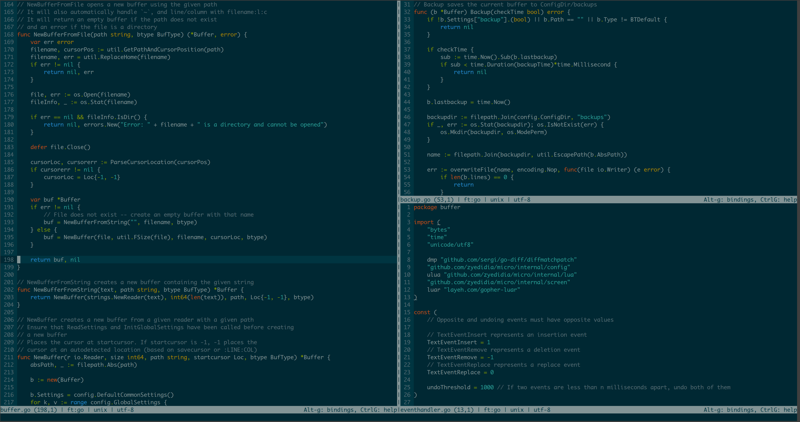

# Secman Settings Editor (Windows)

> powered by [**@zyedidia**](https://github.com/zyedidia)

- - -

You can move the cursor around with the arrow keys and mouse.

You can also use the mouse to manipulate the text. Simply clicking and dragging
will select text. You can also double click to enable word selection, and triple
click to enable line selection.

## Documentation and Help

micro has a built-in help system which you can access by pressing <kbd>Ctrl-e</kbd> and typing `help`. Additionally, you can
view the help files here:

- [main help](https://github.com/zyedidia/micro/tree/master/runtime/help/help.md)
- [keybindings](https://github.com/zyedidia/micro/tree/master/runtime/help/keybindings.md)
- [commands](https://github.com/zyedidia/micro/tree/master/runtime/help/commands.md)
- [colors](https://github.com/zyedidia/micro/tree/master/runtime/help/colors.md)
- [options](https://github.com/zyedidia/micro/tree/master/runtime/help/options.md)
- [plugins](https://github.com/zyedidia/micro/tree/master/runtime/help/plugins.md)

I also recommend reading the [tutorial](https://github.com/zyedidia/micro/tree/master/runtime/help/tutorial.md) for
a brief introduction to the more powerful configuration features micro offers.

## Contributing

If you find any bugs, please report them! I am also happy to accept pull requests from anyone.

You can use the [GitHub issue tracker](https://github.com/zyedidia/micro/issues)
to report bugs, ask questions, or suggest new features.

For a more informal setting to discuss the editor, you can join the [Gitter chat](https://gitter.im/zyedidia/micro).

Sometimes I am unresponsive, and I apologize! If that happens, please ping me.
